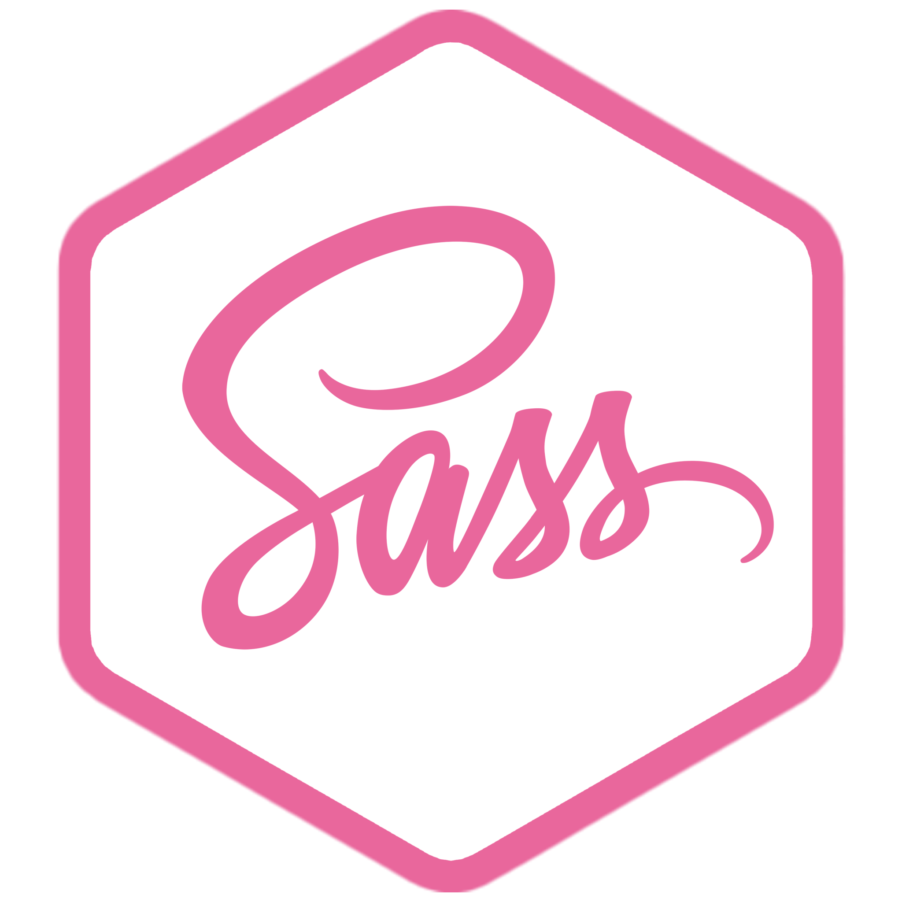

<!--Title Main-->

<h1 align="center">𝓦𝓮𝓵𝓬𝓸𝓶𝓮  𝓽𝓸 𝓶𝔂 𝓟𝓻𝓸𝓯𝓲𝓵𝓮 </h1>

 

 

 
 

<!--SEGUNDO TITULO-->
<h2 align="center">

</h2>

<!--Interests-->

<!--BOX HTML5-->

<!--BOX CSS3-->

<!--BOX SASS-->

<!--BOX JAVASCRIPT-->

<!--BOX ALGORITIMO-->

 
<!--BOX GIT-->

<!--BOX BOOTSTRAP-->

<!--End Interests-->

<!--contact Me-->
<h2 align="center">

</h2>

<!--WHATSAPP-->

<!--GMAIL-->

 
 

